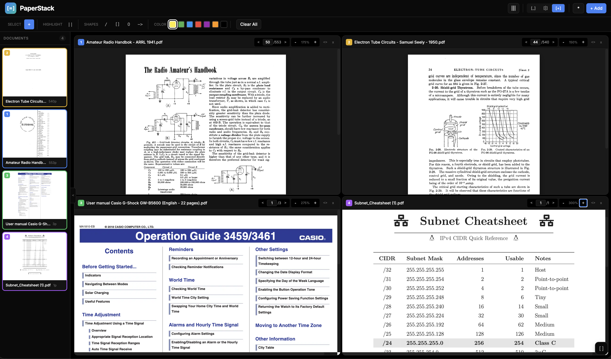

#  PaperStack

**A portable, offline PDF viewer built for air-gapped environments.**

---

## Why PaperStack?

I had a need to review multiple PDF documents in isolated environments with no network access. Existing solutions either required installation, phoned home, or couldn't run from a USB drive. Standard browsers lacked some of the enhanced features contained within this app.

PaperStack is a single HTML file that runs entirely from a browser no servers, no internet, no telemetry. Drop it on a USB stick and you're ready to go.

Developer Note: I understand this app might seem redundant to some of you and that's ok. PaperStack is a purpose built web app for those who don't have access to fancy PDF viewers in restrictive systems.



---

##  Quick Start

1. Download the [latest release](../../releases)
2. Download the two PDF.js files (see below)
3. Open `paperstack.html` in any modern browser

```
PaperStack/
├── paperstack.html
├── pdf.min.js         ← download once
├── pdf.worker.min.js  ← download once
└── README.txt
```

**PDF.js files (one-time download):**
Download from source:
- [pdf.min.js](https://cdnjs.cloudflare.com/ajax/libs/pdf.js/3.11.174/pdf.min.js)
- [pdf.worker.min.js](https://cdnjs.cloudflare.com/ajax/libs/pdf.js/3.11.174/pdf.worker.min.js)
  
Or you can download them from this repo as well.

---

##  Shortcuts

| Key | Action |
|-----|--------|
| `F` | Toggle fullscreen |
| `Esc` | Exit fullscreen |
| `Ctrl/Cmd + C` | Copy selected text |

---

##  Privacy

PaperStack never connects to the internet.

---
##  Legal Disclaimer

This software is provided “as is,” without any warranties of any kind; the author assumes no responsibility or liability for any damages or issues arising from its use.

---
##  License

MIT

PDF.js is developed by Mozilla under the Apache 2.0 license.
